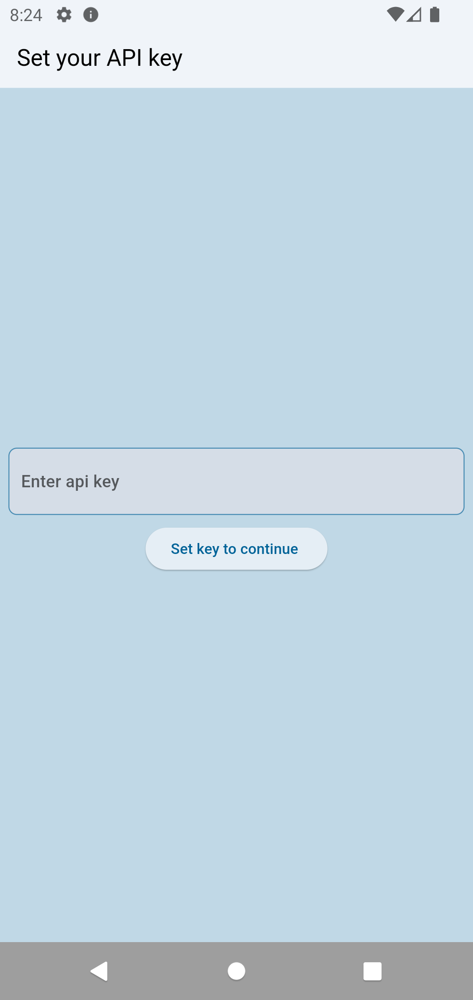
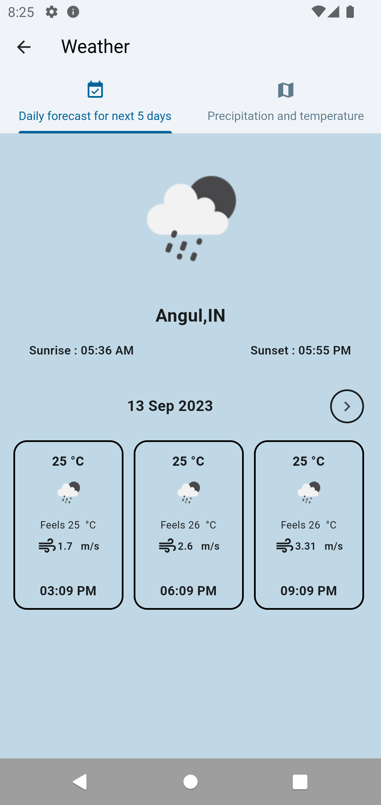
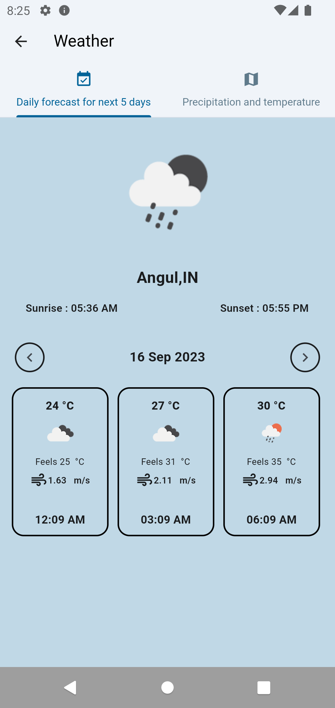

# Weather App🚀


## Screenshots 📸
<p float="left" style="display: flex; justify-content: space-between margin-right: 16px margin-left: 16px;">

     
     
     
    
  
</p>


## Installation 🛠️

To get started with Flutter Sharez, follow these steps:

1. Clone the repository:

   ```bash
   git clone https://github.com/Shreemanarjun/flutter_sharez.git
   ```

2. Navigate to the project directory:

   ```bash
   cd flutter_sharez
   ```

3. Install dependencies:

   ```bash
   flutter pub get
   ```

4. Run the app:

   ```bash
   flutter run
   ```